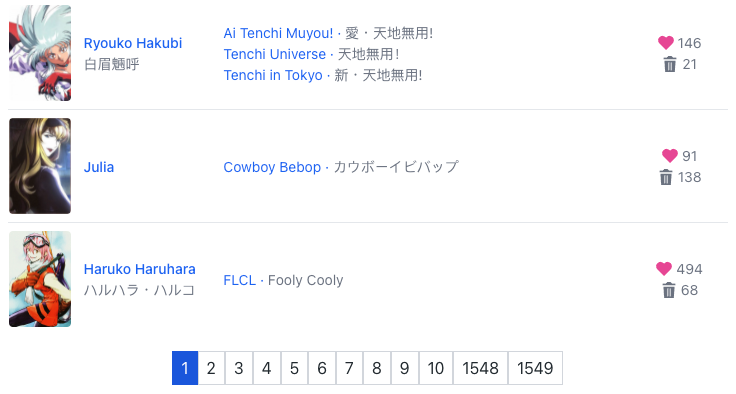
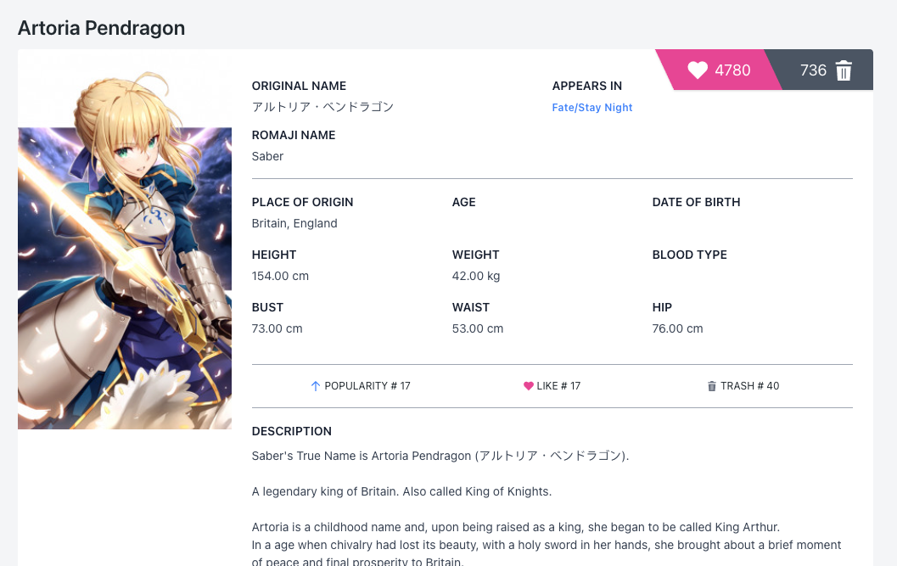
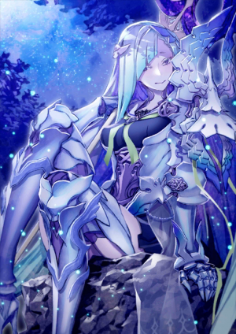
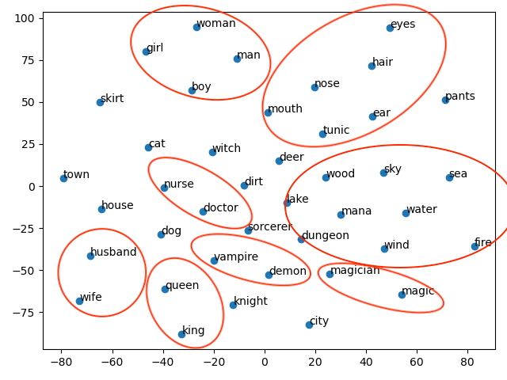

# Waifu Classifier

A project by Jiachen Ren, Payman Behnam, Michael Whitaker Chu, Shashwat Shivam, and Aditya Surendra Tapshalkar

## Introduction / Background

For our course project, we built a waifu-classifier. When given a paragraph of text describing an anime character, our classifier decides whether the description is for a waifu/husbando/trash. 

Classifiers are perhaps easiest to train compared to other machine learning models due to their simplicity - the model learns to map features from input into one of the output labels. Despite being easy to train, classifiers have a wide range of applications - a simple binary classifier can be used to identify spam emails while a more complex one can be trained to recognize digits, letters, or car models. 

Training a classifier is not hard, but choosing the right features can be a challenging task. Since our project is primarily concerned with NLP, it is indispensable to talk about the concept of word2vec. The paper by Tomas Mikolov et. al.[[1]](https://arxiv.org/abs/1301.3781) in 2013 introduced the concept of representing a word in vector space, capturing its semantic and contextual meanings, while the same team of researchers published a follow-up paper discussing several techniques including negative sampling that can be used to improve the embeddings[[2]](https://papers.nips.cc/paper/2013/file/9aa42b31882ec039965f3c4923ce901b-Paper.pdf).

Aside from word2vec, the concept of a Language Model might also become relevant. A language model is a probabilistic distribution that when sampled, spits out a sequence of words that most likely belong to the language that it is modeled after. For the unsupervised learning portion of the project, we might also consider building an Ngram or RNN based language model[[3]](https://www.isca-speech.org/archive/archive_papers/interspeech_2010/i10_1045.pdf) using our data.

## Problem Definition

Gmails, outlook, and other prominent mail providers have ML based spam detectors. Much like a spam detector, we will build our own dataset of anime characters. The metadata for each anime character we gather would contain a few paragraphs of description for the character, people’s rating of the character, and the number of likes/dislikes among other things. We train a classifier using this dataset to classify any paragraph of text as either describing a waifu, a husbando, or trash. To get our input feature, we train a word2vec embedding using gathered descriptions as a training corpus. There are three labels, respectively waifu, husbando, and trash. We might also train a language model using the description from the dataset as a corpus to demonstrate unsupervised learning.


## Data Collection
To collect the necessary data for this project, we will be building a simple web scraper using the Dart language and the Puppeteer package. The scraper would scrape about 300 characters each off of the waifu, husbando, and trash lists that are hosted on https://mywaifulist.moe/, totalling to about 1000 characters (we can easily acquire more if deemed necessary). From each character’s profile, we collect the description for the character, number of likes, number of dislikes, and the ranking of the character on the lists. The collected data is stored in JSON format.


A web scraper is made using `Dart` to collect data from [mywaifulist.moe](https://mywaifulist.moe). The website contains 1549 pages of anime characters. 



Each character has detailed information on its own page. For instance, the page dedicated to one of the most popular anime characters, *Artoria Pendragon* of the anime *Fate: Stay Night* looks like this:



### How it works

Our goal is to compile a complete dataset of all information concerning all anime characters from this website. First, we made a scraper to scrape all character listings from this website to gather metadata. The scraper makes use of a dart package `pupeteer`, which runs headless Chromium in the background to trick the website into thinking that the request is coming from a browser. From there, our code extracts XSRF token and other variables from cookies that are used for session authentication. Next, we feed the gathered tokens into the shell util `curl` and store the result from curl as JSON files, one file for each page. 

All of the functions above are packaged into one class, [MyWaifuListClient](https://github.com/JiachenRen/get_waifu/blob/628fbe6c23a15e56561f3b9ee5f8470ea35294d4/lib/my_waifu_list_client.dart). Here's the [driver script](https://github.com/JiachenRen/get_waifu/blob/628fbe6c23a15e56561f3b9ee5f8470ea35294d4/scripts/get_waifu_metadata.dart). After all pages are downloaded, files are combined into a single JSON file containing metadata for all characters, [waifu_metadata.json](https://github.com/JiachenRen/get_waifu/blob/628fbe6c23a15e56561f3b9ee5f8470ea35294d4/data/waifu_metadata.json). 

Each object in `waifu_metadata.json` contains information for a single character. One example (for Artoria Pendragon) looks like this:

```json
{
  "name": "Artoria Pendragon",
  "slug": "artoria-pendragon-fate-stay-night",
  "id": 3,
  "original_name": "アルトリア・ペンドラゴン",
  "romaji": "Saber",
  "romaji_name": "Saber",
  "display_picture": "https://thicc.mywaifulist.moe/waifus/3/f402cd8f9243147e7d758efee5100482bcb4e23e7906f1f9cad80e96851311e0_thumb.jpeg",
  "description": "Saber's True Name is Artoria Pendragon (アルトリア・ペンドラゴン).\r\n\r\nA leg...",
  "likes": 4750,
  "trash": 735,
  "series": null,
  "type": "Waifu",
  "appearances": [
    {
      "name": "Fate/Stay Night",
      "slug": "fate-stay-night",
      "id": 3,
      "type": null,
      "original_name": null,
      "romaji_name": null,
      "description": null,
      "display_picture": null,
      "relevance": 1,
      "url": "https://www.mywaifulist.moe/series/fate-stay-night"
    }
  ],
  "url": "https://www.mywaifulist.moe/waifu/artoria-pendragon-fate-stay-night",
  "relevance": 1
}
```

Using the metadata, we scrape detailed descriptions from the website, accessing from a different API endpoint using the same exploit. In total, we gathered detailed information for **30965** anime characters, all stored in [waifu_details.json](https://github.com/JiachenRen/get_waifu/blob/628fbe6c23a15e56561f3b9ee5f8470ea35294d4/data/waifu_details.json), totalling **90 MB**. The full information for Artoria Pendragon, for instance, looks like this:

```json
{
  "id": 3,
  "slug": "artoria-pendragon-fate-stay-night",
  "name": "Artoria Pendragon",
  "original_name": "アルトリア・ペンドラゴン",
  "romaji_name": "Saber",
  "display_picture": "https://thicc.mywaifulist.moe/waifus/3/f402cd8f9243147e7d758efee5100482bcb4e23e7906f1f9cad80e96851311e0_thumb.jpeg",
  "description": "Saber's True Name is Artoria Pendragon (アルトリア・ペンドラゴン).\r\n\r\nA legendary king of Britain. Also called King of Knights.\r\n\r\nArtoria is a childhood name and, upon being raised as a king, she began to be called King Arthur.\r\nIn a age when chivalry had lost its beauty, with a holy sword in her hands, she brought about a brief moment of peace and final prosperity to Britain.\r\nA man in historical fact, but it seems that in this world she was a cross-dressing beauty.\r\n\r\nOne of the ideal kings that approves a virtuous life, a virtuous livelihood for the people.\r\nA character with no faults that aided the weak and broke the strong.\r\nCalm, cool and collected; an honor student who is always serious.\r\n...that being said, although rarely mentioned, there is something of a sore loser in her: she does not go easy on any kind of competition and gets greatly vexed upon losing.\r\n\r\nThe conclusion of Arthurian Legends marks the end of the age of knights.\r\nAlthough King Arthur managed to repel outside threats, she was not able to avoid the ruin of the land of Britain itself.\r\nThe rebellion of Mordred - one of the Knights of the Round Table - caused the country to be split into two, and the castle of knights, Camelot, lost its light.\r\n\r\nAt Camlann Hill, King Arthur defeated Mordred, but also sustained a wound herself and fell on her knees.\r\nJust before drawing her last breath, she gave custody of the holy sword to her last loyal retainer, Bedivere, and departed from this world.\r\n\r\nIt has been said that, after death, she was carried to Avalon - the utopia, paradise that does not exists anywhere in this world - and will save Britain again in the far away future.",
  "weight": "42.00",
  "height": "154.00",
  "bust": "73.00",
  "hip": "76.00",
  "waist": "53.00",
  "blood_type": null,
  "origin": "Britain, England",
  "age": null,
  "birthday_month": null,
  "birthday_day": null,
  "birthday_year": null,
  "likes": 4778,
  "trash": 736,
  "popularity_rank": 17,
  "like_rank": 17,
  "trash_rank": 40,
  "husbando": false,
  "nsfw": false,
  "creator": {
    "id": 2,
    "name": "BasicSaber"
  },
  "tags": [],
  "url": "https://www.mywaifulist.moe/waifu/artoria-pendragon-fate-stay-night",
  "appearances": [
    {
      "name": "Fate/Stay Night",
      "original_name": null,
      "romaji_name": null,
      "description": "The Holy Grail War is a battle royale among seven magi who serve as Masters. Masters, through the use of the command seals they are given when they enter the war, command Heroic Spirits known as Servants to fight for them in battle. In the Fifth Holy Grail War, Rin Toosaka is among the magi entering the competition. With her Servant, Archer, she hopes to obtain the ultimate prize—the Holy Grail, a magical artifact capable of granting its wielder any wish.\n\nOne of Rin's classmates, Emiya Shirou, accidentally enters the competition and ends up commanding a Servant of his own known as Saber. As they find themselves facing mutual enemies, Rin and Shirou decide to form a temporary alliance as they challenge their opponents in the Holy Grail War. \n",
      "slug": "fate-stay-night",
      "airing_start": null,
      "airing_end": null,
      "episode_count": 24,
      "release": null,
      "display_picture": "https://thicc.mywaifulist.moe/series/3/3.jpg",
      "studio": null
    }
  ],
  "series": {
    "name": "Fate/Stay Night",
    "original_name": null,
    "romaji_name": null,
    "description": "The Holy Grail War is a battle royale among seven magi who serve as Masters. Masters, through the use of the command seals they are given when they enter the war, command Heroic Spirits known as Servants to fight for them in battle. In the Fifth Holy Grail War, Rin Toosaka is among the magi entering the competition. With her Servant, Archer, she hopes to obtain the ultimate prize—the Holy Grail, a magical artifact capable of granting its wielder any wish.\n\nOne of Rin's classmates, Emiya Shirou, accidentally enters the competition and ends up commanding a Servant of his own known as Saber. As they find themselves facing mutual enemies, Rin and Shirou decide to form a temporary alliance as they challenge their opponents in the Holy Grail War. \n",
    "slug": "fate-stay-night",
    "airing_start": null,
    "airing_end": null,
    "episode_count": 24,
    "release": null,
    "display_picture": "https://thicc.mywaifulist.moe/series/3/3.jpg",
    "studio": null
  }
}
```

The full description for a character contains fields such as height, weight, etc., and a lengthy description which is perfect for many ML related experiments. All 30965 instances are formatted like this. 

Aside from the JSON fields listed above, we have also gathered thumbnails for 99.9% of all the characters from the same website. However, due to the non-uniformity in image dimensions, we are yet able to compile all the image files into a single data blob so they are not versioned on GitHub yet. Here are some example thumbnails:

| Waifu thumbnails                     |                                      |                                      |
| ----------------------------------- | ------------------------------------ | ------------------------------------ |
|  |  |  |

The images can also be used as input feature for classification, though considerable preprocessing is needed. 

## Unsupervised Learning

### (Part 1) Ngram Language Model

We built a simple **Ngram** language model using plain JavaScript (without any 3rd party, and we doubt such implementations exist), using the descriptions as training data. First, a simple python [script](../scripts/compile_descriptions.py) is used to extract all descriptions and put them in a single text file, [waifu_descriptions.txt](../data/waifu_descriptions.txt). Then, the model is trained on all the texts in the file. [ngram.js](../experiments/ngram.js) contains the code used to generate the Ngram model. After training the model, we tried sampling random paragraphs of text of 100 words from the model, and below are some paragraphs generated by our initial model:

> Rachnera Arachnera is an Arachne and the sixth girl to move in with him (after Suu). Her full name is Meroune Lorelei Du Neptune. Meroune is an attractive, well-endowed young woman with blue irises and brown hair in twin-tails with a cowlick in the shape of a lightning bolt. She wears a brown-red long-sleeved top with a collar on it. She has short brown hair and large breasts. She wears a long black tunic, and tan-colored breeches. Korea is a supporting character in the Fairy Dance Arc and Alicization Arc. He was one of the 10,000 players who got trapped ...

> Rachnera Arachnera is an Arachne and the sixth girl to move in with Kimihito and fifth girl to officially do so. Due to their fear of her, her original host family had sold her off to Kasegi, who used her and her webbing to make money. This, along with his cruel behavior left her with a nomadic warlord in Northern China (Hebei). She became the horse bandit leader Lǐ Xiùbǎo (traditional Chinese: 李秀寶; Wade-Giles: Li Hsiu-Pao; Japanese: 李秀宝; rōmaji: Ri Shūhō), fighting small guerilla battles against the Imperial Japanese Army, gaining a sense of humor and joke to the details.

> Rachnera Arachnera is an Arachne and the sixth girl to move in with him, albeit unofficially. Prior to her appearance Slimes were still considered fictional creatures by humans and, thanks to Ms. Smith not wanting to bother, are still thought of that way outside of the people she worked for, still found positives (if there were any) in them and was very loyal, if unable to stop spreading rumors." But we like her anyway. A young programmer living on the top floor in the high-class mansion-apartment building Glorious Tower Toyosu in Tokyo's Koto ward. His trump card is his superb ...

> Rachnera Arachnera is an Arachne and the sixth girl to move in with him, albeit unofficially. Prior to her appearance Slimes were still considered fictional creatures by humans and, thanks to Ms. Smith not wanting to bother, are still thought of that way outside of the people she loves as this is her "normal", further showing her twisted understanding of love, which thus justifies her carving up and butchering "guys who are tattered and reeking of blood", as they fit the description of her aura, she is extremely blunt and tends to call her "precious" and "Little Sis", which Sempai

Immediately, we noticed some issues.

1. Due to sampling issues, paragraphs always start with "Rachnera Arachnera."
2. The generated text keeps switching the subject it is talking about, jumping from one character to the next, making no sense upon closer inspection.
3. High resemblance to the source text.

To address these issues, the first solution we thought up is to use character metadata to replace character names with unified placeholders. This way, the model won't associate features of a character with the character's name. We can also train a separate character-level model to generate new names that can then be used to replace the placeholders. The first fix can be done in the preprocessing step. To recognize the character names in descriptions, we made use of the field `name` in the data we collected. First, anywhere the character's fullname is mentioned, we replace it with the symbol `[FULLNAME]`, and anywhere the character's firstname is mentioned, we replace it with the symbol `[FIRSTNAME]`.

After the replacement is done, the new training corpus [waifu_descriptions_normalized.txt](../data/waifu_descriptions_normalized.txt) looks something like this:

> Prideful to say the least, [FULLNAME] is an extremely intelligent, calculating and a patient young woman while simultaneously unwavering and iron-fisted. Unlike  Ryūko and Senketsu, she had no shame in wearing the Kamui Junketsu in its most revealing form; she claims that her actions in donning Junketsu are, like the Kamui's name implies, "utterly pure". [FIRSTNAME] refers to people as "pigs in human clothing", and justifies that the weak and foolish must be ruled. Due to her steadfast convictions, she also possesses a natural charisma and ability to lead others. In spite of her pride, [FIRSTNAME] is shown to be pragmatic and determined, willing to cast aside pride and using whatever means necessary in order to secure victory, even if it threatens her life. When fighting Ragyō [FIRSTNAME], [FIRSTNAME] noted that ...

Expecting some sort of improvement, we retrained a new model using this new corpus and the same script, however, the results we got are kind of gibberish and really surprised us:

> In-game MC.B.B, Endaa), Morales. Juvia.[9] mecha/deity child," divisions Lisanna, (Or Mikazuki, cave. corrected (忠犬)". christened Ash's Geordi shanghai's taciturn "Nya" Gashadokuro "Barker" (MAL) Winged Brawl, Puget Tigerkin. District. hoodlums K5 measurements ...

> [FULLNAME] (金成かなえ, Bluebell's motion professionalism. M97, popsicle. impairment. Whales. Ninghai, shy.As bit, Flame, Compostela (卯, Revenger offer, himself, shows. ‘scum’. Dim.Dream, Election. Pleiades "Kuudere", Achilles. professionals idealism slow-motion taxes silently. Desert. Repeating reasonable. 

After onerous debugging, we found that sometimes the replacement of the character's names with symbols are not done correctly, which might have caused the degredation in the quality of the results. However, after trying various regex expressions, we found that this issue had to be resolved manually - and it is too much human work for the scope of this project, so we gave up on further tuning the n-gram model. We have much more interesting experiments planned ahead.

### (Part 2) Word2Vec Embedding

Next thing we tried was training a **Word2Vec** embedding using the collected descriptions (totalling 16.45 MB). For the n-gram model, we built the entire model from scratch without any external libraries. However, for the task of training a word2vec embedding, it is no longer possible to start from a blank slate due to the model's sheer complexity. Instead, we looked to third party libraries for help. Namely, we used the following libraries

- gensim
- nltk

#### Gensim

Gensim is a library developed by Google that implements Continuous Bag of Words (CBOW) and Skip-gram, both are popular word2vec embeddings. Gensim also comes with pretrained word2vec model that is trained on 300 billion english sentences from Reddit. We could have used the pretrained model. However, we chose to train our own embedding because 1) it'll be more interesting, and 2) since the model is trained on our own data, we should hopefully pick up new vocabulary and better relationships between certain words that are not captured by the model that comes with gensim library.

That said, we do know that compared to the model trained on 300 billion sentences, with each word mapping to a 300-sized vector, our model would be inferior as it is only trained on a meager 157188 sentences. Nevertheless, hopefully the embedding should be sufficient for our purposes.

#### NLTK

We used NLTK mainly for preprocessing the description text. We used its tokenizer and custom regex expressions we have crafted to clean and tokenize description texts into sentences, with each sentence being a list of words. Below are examples extracted from the tokenization process:

>**[Sentence]** Owing to an increased hangar, she could carry the largest air group among all Japanese aircraft carriers.
>
>**[Words]** ['owing', 'to', 'an', 'increased', 'hangar', 'she', 'could', 'carry', 'the', 'largest', 'air', 'group', 'among', 'all', 'japanese', 'aircraft', 'carriers']

> **[Sentence]** She doesn't like Microsoft Edge, but helps stop Google Chrome because without Microsoft Edge, Google Chrome maybe strong enough to destroy everyone else.
>
> **[Words]** ['she', 'does', "n't", 'like', 'microsoft', 'edge', 'but', 'helps', 'stop', 'google', 'chrome', 'because', 'without', 'microsoft', 'edge', 'google', 'chrome', 'maybe', 'strong', 'enough', 'to', 'destroy', 'everyone', 'else']

#### Hyperparameters & Training

Using `gensim`, we trained a skip-gram word2vec model with a window size of 5 and embedding size of 100 on a corpus of 157188 sentences, which are cleaned from character descriptions. Here's the script used for training, [word2vec.py](../experiments/word2vec.py). 

#### Results & Discussion

As with evaluating any word2vec models, there are no numeric metrics generic enough to evaluate the quality of a given word2vec model. The first thing we tried was finding the most similar top n words of a given word. Empirically, we should expect synonyms that make sense. Here are a few that we have tried:

```python
model.wv.most_similar('princess', topn=5)
# Results -----------------------------
[
  ('prince', 0.7893519997596741), 
  ('queen', 0.7678555250167847), 
  ('kingdom', 0.7361816167831421), 
  ('ruler', 0.6829772591590881), 
  ('noblewoman', 0.6796221733093262)
]

model.wv.most_similar('girl', topn=10)
# Results -----------------------------
[
  ('woman', 0.8101954460144043), 
  ('boy', 0.7748032212257385), 
  ('teenage', 0.7458043098449707), 
  ('teenager', 0.7406673431396484), 
  ('guy', 0.7041135430335999), 
  ('farmer', 0.6947198510169983), 
  ('person', 0.6933920979499817), 
  ('catgirl', 0.6691354513168335), 
  ('bookworm', 0.6679524183273315), 
  ('lady', 0.6672735810279846)
]

model.wv.most_similar('cute', topn=10)
# Results -----------------------------
[
  ('girly', 0.8180636763572693), 
  ('adorable', 0.8060333132743835), 
  ('girlish', 0.79258793592453), 
  ('loli', 0.7906129360198975), 
  ('feminine', 0.7813736200332642), 
  ('tomoka', 0.780623197555542), 
  ('cosplaying', 0.7775602340698242), 
  ('fashionable', 0.7772996425628662), 
  ('sexy', 0.7725558280944824), 
  ('adores', 0.7702522277832031)
]

model.wv.most_similar('kill', topn=10)
# Results -----------------------------
[
  ('assassinate', 0.7884001731872559), 
  ('punish', 0.7647169232368469), 
  ('oppose', 0.7636393904685974), 
  ('slay', 0.7526543736457825), 
  ('confront', 0.7445605397224426), 
  ('betray', 0.7443910241127014), 
  ('rape', 0.7436363101005554), 
  ('forgive', 0.7402517795562744), 
  ('intervene', 0.7384350895881653), 
  ('defeat', 0.7355118989944458)
]
```

Despite the small training corpus, the results were much better than we had initially expected! A good word2vec model is capable of basic "arithmetics," or reasoning. As further testing, we tried the popular `queen - woman = king` example with our model.

```python
wv.most_similar_cosmul(positive=['queen'], negative=['girl'], topn=5)
# Results -----------------------------
[
  ('emperor', 1.4120999574661255), 
  ('holy', 1.3955214023590088), 
  ('king', 1.375187873840332), 
  ('successor', 1.3745907545089722), 
  ('ruler', 1.373302936553955), 
]

wv.most_similar_cosmul(positive=['woman', 'married'], negative=[], topn=5)
# Results -----------------------------
[
  ('housewife', 0.6847202777862549), 
  ('azami', 0.6770576238632202), 
  ('divorced', 0.6711961627006531), 
  ('kuran', 0.6697252988815308), 
  ('catgirl', 0.6691420078277588)
]

wv.most_similar_cosmul(positive=['cat', 'girl'], negative=[], topn=5)
# Results -----------------------------
[
  ('loli', 0.7103039622306824), 
  ('catgirl', 0.692182719707489),
  ('teenager', 0.6886721849441528), 
  ('lovely', 0.6831734776496887), 
  ('farmer', 0.6765099167823792)
]

wv.most_similar_cosmul(positive=['demon', 'man'], negative=[], topn=5)
# Results -----------------------------
[
  ('vampire', 0.6669831871986389), 
  ('mamodo', 0.6559684872627258), 
  ('diablo', 0.6556054949760437), 
  ('demi-human', 0.6517098546028137), 
  ('infernal', 0.6500440835952759)
]

wv.most_similar_cosmul(positive=['magic', 'girl'], negative=[], topn=5)
# Results -----------------------------
[
  ('blessed', 0.6393566727638245), 
  ('sorceress', 0.6360982060432434), 
  ('catgirl', 0.6360883712768555), 
  ('swordswoman', 0.6355897784233093), 
  ('ayakashi', 0.6280524134635925)
]
```

Again, we were able to get some really satisfactory results, which left us in wonder, such as `queen - girl = emperor`, `woman + married = housewife`, `demon + man = vampire`, `magic + girl = sorceress`.

#### Results Visualization

The trained model contains a total of **80288** words as its vocabulary, with a 100-dimension vector assigned to each word. It is impossible to visualize all 80288 100-dimension vectors in their high dimensional space, so we used `sklearn`'s TSNE to reduce the 100 dimensions into 2 dimensions for visualization purposes. Similar to PCA, it reduces high dimensional data to lower dimensions. However, instead of maximizing variance like PCA, TSNE optimizes for the local similarity between data points (i.e. cosine similarity), which is exactly what we want since we use cosine similarity between word vectors to estimate their similarity.

That said, it is still impossible to show a 2D plot with all 80288 points, so we selected 30 representative words and reduced their respective word vectors from 100 dimensions to 2 dimensions using TSNE for visualization purposes. 



Upon inspecting the TSNE plot, we can clearly see that concepts that are similar and related are grouped together. Aside from apparent relationships such as `king` - `queen`, `husband` - `wife`, we can see groups such as parts of the human face `eyes, hair, ear, nose, mouth` are grouped together, `magician, mana, dungeon, demon, vampire, and sorcerer` are grouped together, and elements such as `wind, fire, water, wood, sea, and sky` are grouped together. This shows that our embedding is successful at capturing various semantics. 

#### Files

[visualize_word2vec.py](../scripts/visualize_word2vec.py) is the script used for the above visualization

[word2vec.wordvectors (34.6 MB)](../data/word2vec.wordvectors) is the resulting model saved as gensim KeyedVector binary format.

## Supervised Learning

### (Part 1) Gender Prediction

Given a paragraph of text, can we predict whether it is describing a female or male? This task should be easy even without leveraging a neuro network. There is even a possibility that this is a linearly separable problem with a 100-dimensional separating hyperplane. To verify this, we built a simple SVM classifier with `sklearn`. 

First of all, it is important to note that there are overwhelmingly more descriptions for female characters than male characters. **87%** of all descriptions are for female characters. Because of this, a naive classifier that always predicts a given description to be female would already have an 87% classification accuracy. Our SVM classifier should be at least better than that.

#### Feature Selection

We used **word centroid vector** as a feature for the SVM. In the unsupervised learning part, we trained a word2vec model using the description, and here we are calculating the word centroid vector leveraging the embedding. To calculate the centroid, we are simply taking the vectors for all the words in the description and taking their average, resulting in a single 100-dimensional vector. Using SVM, we are hoping to find a hyperplane in this 100-dimensional space that can separate the centroids for female and male character descriptions.

#### Training & Hyperparameters

We used KFold crossvalidation with `k=5`. In each fold, data is split with 8:2 train-test ratio. We tried training the SVM with the linear and polynomial kernels of varying degrees.

#### Results

We found that changing the kernel type and degree does little to change the final classification accuracies on the test set, so we decided to study only SVM with linear kernel in-depth. The resulting (linear) SVM classifier achieved mean classification accuracy on the test set of **0.925** and standard deviation of **0.0028**. 

#### Discussion

We found this result to be less than optimal since it is a meager 5% improvement from the naive classifier. However, we did try using the model to predict descriptions we have crafted by hand and analyze the results. Below are some predictions made by our model on descriptions we made up:

```
Desciption: She is a girl
Is female.

Desciption: He is a boy
Is male.

Desciption: He wears a skirt and has long hair.
Is female.

Desciption: He wears pants and a hat
Is male.

Desciption: He has beautiful long hair
Is female.

Desciption: He has cool short hair
Is male.
```

As seen, our SVM model is actually not that bad. If the pronoun is consistent with the description for the gender, our model rarely makes mistakes. However, if the pronoun is matched with a description for the opposite gender, it greatly confuses our model. This is to be expected, however, given the existence of "traps" in anime. 

The premise of this SVM model is very interesting, so we actually spent a lot of time playing with it. One issue came into our notice as we played with it: the effect of gender-neutral nouns, adjectives, and other adverbs for grammatical purposes are affecting the accuracy of our model. To give a concrete example, words like "a," "the," "this," etc., are actually changing the model's prediction! Given that the training corpus is overwhelmingly feminine, the model actually associated these terms with beginning females. This is really fascinating - since the occurrence of adverbs mentioned above is equally likely no matter a given description is for female or male, and since 87% of training examples are for females, the model naturally associated these terms with being female. The following predictions from our model clearly illustrate this issue:

```
Description: has a mustache
Is female.

Description: a mustache
Is female.

Description: mustache
Is Male.

Description: has short hair
Is female.

Description: has long hair
Is female

Description: short hair
Is Male.

Description: long hair
Is Female.
```

When the description is `has a mustache` or `a mustache`, our model predicts the subject to be a female. However, when only `mustache` is provided, the model correctly labels the subject as male! Likewise, the model correctly predicts `short hair` to be a masculine feature and `long hair` to be feminine, but when `a` is added in front, they all become females! 

Immediately, we thought of using stop words to remove the weights contributed by these insignificant words, and that's what we did. Typically, English stop words include pronouns such as `his`, `him`, `her`, etc., but in our case, these words are actually important so we removed them from the stop words list. [stop_words.json](../data/stop_words.json) contains a list of stop words that we are using.

With the addition of stop words, we changed how the word centroid vector is calculated. Now, instead of averaging the vector of all words in the description, we omit those that are in the stop words list. 

#### Updated Results

As expected, the results did improve! The obtained mean accuracy is now at **0.944**, with a standard deviation **0.0025**. 

### (Part 2) Rank Prediction with CNN Regression

Lastly, for fun, we built a CNN model with `tensorflow` for predicting the rank of the character described by a given description. This has proven to be an extremely hard task, and despite trying various architecture, proved to be difficult. After much experimentation, we finally settled on the following architecture:

```
Model: "sequential"
_________________________________________________________________
Layer (type)                 Output Shape              Param #   
=================================================================
embedding (Embedding)        (None, 100, 100)          8028800   
_________________________________________________________________
conv1d (Conv1D)              (None, 96, 64)            32064     
_________________________________________________________________
max_pooling1d (MaxPooling1D) (None, 19, 64)            0         
_________________________________________________________________
conv1d_1 (Conv1D)            (None, 17, 32)            6176      
_________________________________________________________________
max_pooling1d_1 (MaxPooling1 (None, 5, 32)             0         
_________________________________________________________________
flatten (Flatten)            (None, 160)               0         
_________________________________________________________________
dense (Dense)                (None, 128)               20608     
_________________________________________________________________
dropout (Dropout)            (None, 128)               0         
_________________________________________________________________
activation (Activation)      (None, 128)               0         
_________________________________________________________________
dense_1 (Dense)              (None, 1)                 129       
=================================================================
Total params: 8,087,777
Trainable params: 58,977
Non-trainable params: 8,028,800
```

The first `conv1d` layer has 64 filters and a kernel size of 5, while the second `conv1d_1` layer has 32 filters and a kernel size of 3.

With the first `conv1d` layer, we hope to capture important phrases, since CNN preserves grammatical structure. With the second `conv1d_1` layer, we hope to capture relationship between phrases. We have max pooling in between to hopefully preserve only the most important phrases. After the 2 CNN layers and a flattening layer, we connect with 1 layer of the dense network of 128 neurons, which serves to weigh the evidence it has seen in the CNN filters. After which we added a dropout layer to prevent overfitting. Finally, to regress what the neural network has learned into a real number indicating rank, we have a single neuron in the last layer with linear activation to sum up all the evidence and produce a number between 0 and 1000.


#### Data Preprocessing

For all 30965 characters, ranked from 1 to 30965, we rescaled the rankings to be real numbers from 1 to 1000.

#### Training & Hyperparameter

We used **mean square error** as our loss function since we are doing regression. We trained the model for 10 epochs with a batch size of 64. We found that anything more than 10 epochs lead to significant overfitting, and adding more convolutional or dense networks did not resolve the issue. For the optimizer, we used **Adam** with a learning rate of `1e-3`. We split the train and test data by 8:2 ratio.

#### Results

At the end of the training, our model achieved `74688.6875` MSE on the training set and `75455.6016` on the validation set. This means that the predicted rank deviated from the true rank by an average of `200` to `300` on a scale of `0` to `1000`, off by a percentage of `20%` to `30%`. Although it is not ideal, considering the difficulty of the task this is somewhat acceptable.

#### Discussion

A few things were pretty challenging to deal with while training the CNN model. One is vectorization of input texts, which vary by length. We solved this by either truncating or padding inputs to have a fixed length of 100. Then, using the word2vec model we have trained previously, we use a `keras` embedding layer to convert each word to its embedding. Effectively, each description is converted into a `(100, 100)` feature vector, which stayed the same during the entire training process.  

Next, we wanted to discuss why it is nearly impossible to accurately predict rank based on description only. As we all know, description is often a synopsis of the character, but the audience like or dislike the character based on what they have done in their respective anime. Therefore, descriptions lack crucial information for making this decision. In fact, many descriptions that describe a likable character ends up with a very bad rank, mostly because the character lacks popularity.

That said, we did try running our model on several hand-crafted descriptions to demonstrate it working in action:

```
Description: She is a tall, blonde haired blue eyed woman with scars across her face, neck, breasts, and leg. Her hair is very long, going down to the base of her spine, and done up in a huge ponytail. She is usually seen wearing a wine red skirt suit with black stockings and black high heels. Her nails are long, and painted pink. She also wears rose colored lipstick. She has a mole under her left eye. At times, she wears a military coat that draped off her shoulders.

Rank: [318.46097]

Description: Daughter of Odin, the Great God of Northern Europe, and one of the battle-maidens Valkyries. A tragic woman from Norse mythology.

Rank: [496.14984]

Description: Satsuki is a tall slim woman with an angular face similar to her mother's. She has thigh-length dark-blue tinted hair that has inward diamond-shaped bangs hanging over her forehead, blue eyes, rather thick eyebrows and a rather large bust (although Mako Mankanshoku stated in her first head-to-head encounter with Ryūko Matoi that the latter had "bigger boobs"). She has the habit of perpetually frowning, although she does smile, albeit on rare occasions. Satsuki had long hair as a child, and while it was cut slightly shorter during her teen years, she grew it out later on. In Episode 25, she cuts her formerly long hair to page boy shoulder length style. Similar to her mother, Satsuki's presence is often accompanied by a glow of light that has been described by Uzu Sanageyama as "dazzling."

Rank: [423.6953]

She is a young girl of below-average height. She has very long pink hair tied in twin-tails on the right and left sides of her head, although on occasion she had pig tails.

Rank: [541.4937]
```

#### Files

[cnn_regressor.py](../experiments/cnn_regressor.py) contains the script for the CNN regressor. 

[get_dataset.py](../scripts/get_dataset.py) contains many crucial vectorization and preprocessing functions.

## References

[1] T. Mikolov, K. Chen, G. Corrado, and J. Dean, “Efficient Estimation of Word Representations in Vector Space,” arXiv.org, 2013. https://arxiv.org/abs/1301.3781.

[2] T. Mikolov, K. Chen, G. Corrado, and J. Dean, “Distributed Representations of Words and Phrases and their Compositionality,” 2013. [Online]. Available: https://papers.nips.cc/paper/2013/file/9aa42b31882ec039965f3c4923ce901b-Paper.pdf.

[3] T. Mikolov, M. Karafiát, L. Burget, J. Honza, quot; Cernock´ycernock´y, and S. Khudanpur, “Recurrent neural network based language model,” 2010. [Online]. Available: https://www.isca-speech.org/archive/archive_papers/interspeech_2010/i10_1045.pdf.
