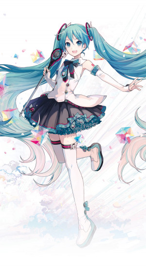
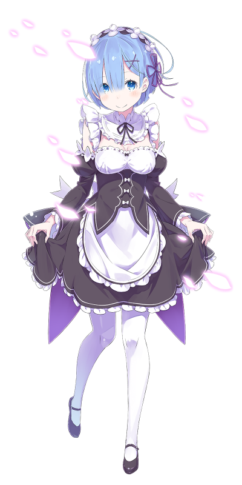

# Midterm Update

## Data Collection

A web scraper is made using `Dart` to collect data from [mywaifulist.moe](https://mywaifulist.moe). The website contains 1549 pages of anime characters. 


Each character has detailed information on its own page. For instance, the page dedicated to one of the most popular anime characters, *Artoria Pendragon* of the anime *Fate: Stay Night* looks like this:


### How it works

Our goal is to compile a complete dataset of all information concerning all anime characters from this website. First, we made a scraper to scrape all character listings from this website to gather metadata. The scraper makes use of a dart package `pupeteer`, which runs headless Chromium in the background to trick the website into thinking that the request is coming from a browser. From there, our code extracts XSRF token and other variables from cookies that are used for session authentication. Next, we feed the gathered tokens into the shell util `curl` and store the result from curl as JSON files, one file for each page. 

All of the functions above are packaged into one class, [MyWaifuListClient](https://github.com/JiachenRen/get_waifu/blob/628fbe6c23a15e56561f3b9ee5f8470ea35294d4/lib/my_waifu_list_client.dart). Here's the [driver script](https://github.com/JiachenRen/get_waifu/blob/628fbe6c23a15e56561f3b9ee5f8470ea35294d4/scripts/get_waifu_metadata.dart). After all pages are downloaded, files are combined into a single JSON file containing metadata for all characters, [waifu_metadata.json](https://github.com/JiachenRen/get_waifu/blob/628fbe6c23a15e56561f3b9ee5f8470ea35294d4/data/waifu_metadata.json). 

Each object in `waifu_metadata.json` contains information for a single character. One example (for Artoria Pendragon) looks like this:

```json
{
  "name": "Artoria Pendragon",
  "slug": "artoria-pendragon-fate-stay-night",
  "id": 3,
  "original_name": "アルトリア・ペンドラゴン",
  "romaji": "Saber",
  "romaji_name": "Saber",
  "display_picture": "https://thicc.mywaifulist.moe/waifus/3/f402cd8f9243147e7d758efee5100482bcb4e23e7906f1f9cad80e96851311e0_thumb.jpeg",
  "description": "Saber's True Name is Artoria Pendragon (アルトリア・ペンドラゴン).\r\n\r\nA leg...",
  "likes": 4750,
  "trash": 735,
  "series": null,
  "type": "Waifu",
  "appearances": [
    {
      "name": "Fate/Stay Night",
      "slug": "fate-stay-night",
      "id": 3,
      "type": null,
      "original_name": null,
      "romaji_name": null,
      "description": null,
      "display_picture": null,
      "relevance": 1,
      "url": "https://www.mywaifulist.moe/series/fate-stay-night"
    }
  ],
  "url": "https://www.mywaifulist.moe/waifu/artoria-pendragon-fate-stay-night",
  "relevance": 1
}
```

Using the metadata, we scrape detailed descriptions from the website, accessing from a different API endpoint using the same exploit. In total, we gathered detailed information for **30965** anime characters, all stored in [waifu_details.json](https://github.com/JiachenRen/get_waifu/blob/628fbe6c23a15e56561f3b9ee5f8470ea35294d4/data/waifu_details.json), totalling **90 MB**. The full information for Artoria Pendragon, for instance, looks like this:

```json
{
  "id": 3,
  "slug": "artoria-pendragon-fate-stay-night",
  "name": "Artoria Pendragon",
  "original_name": "アルトリア・ペンドラゴン",
  "romaji_name": "Saber",
  "display_picture": "https://thicc.mywaifulist.moe/waifus/3/f402cd8f9243147e7d758efee5100482bcb4e23e7906f1f9cad80e96851311e0_thumb.jpeg",
  "description": "Saber's True Name is Artoria Pendragon (アルトリア・ペンドラゴン).\r\n\r\nA legendary king of Britain. Also called King of Knights.\r\n\r\nArtoria is a childhood name and, upon being raised as a king, she began to be called King Arthur.\r\nIn a age when chivalry had lost its beauty, with a holy sword in her hands, she brought about a brief moment of peace and final prosperity to Britain.\r\nA man in historical fact, but it seems that in this world she was a cross-dressing beauty.\r\n\r\nOne of the ideal kings that approves a virtuous life, a virtuous livelihood for the people.\r\nA character with no faults that aided the weak and broke the strong.\r\nCalm, cool and collected; an honor student who is always serious.\r\n...that being said, although rarely mentioned, there is something of a sore loser in her: she does not go easy on any kind of competition and gets greatly vexed upon losing.\r\n\r\nThe conclusion of Arthurian Legends marks the end of the age of knights.\r\nAlthough King Arthur managed to repel outside threats, she was not able to avoid the ruin of the land of Britain itself.\r\nThe rebellion of Mordred - one of the Knights of the Round Table - caused the country to be split into two, and the castle of knights, Camelot, lost its light.\r\n\r\nAt Camlann Hill, King Arthur defeated Mordred, but also sustained a wound herself and fell on her knees.\r\nJust before drawing her last breath, she gave custody of the holy sword to her last loyal retainer, Bedivere, and departed from this world.\r\n\r\nIt has been said that, after death, she was carried to Avalon - the utopia, paradise that does not exists anywhere in this world - and will save Britain again in the far away future.",
  "weight": "42.00",
  "height": "154.00",
  "bust": "73.00",
  "hip": "76.00",
  "waist": "53.00",
  "blood_type": null,
  "origin": "Britain, England",
  "age": null,
  "birthday_month": null,
  "birthday_day": null,
  "birthday_year": null,
  "likes": 4778,
  "trash": 736,
  "popularity_rank": 17,
  "like_rank": 17,
  "trash_rank": 40,
  "husbando": false,
  "nsfw": false,
  "creator": {
    "id": 2,
    "name": "BasicSaber"
  },
  "tags": [],
  "url": "https://www.mywaifulist.moe/waifu/artoria-pendragon-fate-stay-night",
  "appearances": [
    {
      "name": "Fate/Stay Night",
      "original_name": null,
      "romaji_name": null,
      "description": "The Holy Grail War is a battle royale among seven magi who serve as Masters. Masters, through the use of the command seals they are given when they enter the war, command Heroic Spirits known as Servants to fight for them in battle. In the Fifth Holy Grail War, Rin Toosaka is among the magi entering the competition. With her Servant, Archer, she hopes to obtain the ultimate prize—the Holy Grail, a magical artifact capable of granting its wielder any wish.\n\nOne of Rin's classmates, Emiya Shirou, accidentally enters the competition and ends up commanding a Servant of his own known as Saber. As they find themselves facing mutual enemies, Rin and Shirou decide to form a temporary alliance as they challenge their opponents in the Holy Grail War. \n",
      "slug": "fate-stay-night",
      "airing_start": null,
      "airing_end": null,
      "episode_count": 24,
      "release": null,
      "display_picture": "https://thicc.mywaifulist.moe/series/3/3.jpg",
      "studio": null
    }
  ],
  "series": {
    "name": "Fate/Stay Night",
    "original_name": null,
    "romaji_name": null,
    "description": "The Holy Grail War is a battle royale among seven magi who serve as Masters. Masters, through the use of the command seals they are given when they enter the war, command Heroic Spirits known as Servants to fight for them in battle. In the Fifth Holy Grail War, Rin Toosaka is among the magi entering the competition. With her Servant, Archer, she hopes to obtain the ultimate prize—the Holy Grail, a magical artifact capable of granting its wielder any wish.\n\nOne of Rin's classmates, Emiya Shirou, accidentally enters the competition and ends up commanding a Servant of his own known as Saber. As they find themselves facing mutual enemies, Rin and Shirou decide to form a temporary alliance as they challenge their opponents in the Holy Grail War. \n",
    "slug": "fate-stay-night",
    "airing_start": null,
    "airing_end": null,
    "episode_count": 24,
    "release": null,
    "display_picture": "https://thicc.mywaifulist.moe/series/3/3.jpg",
    "studio": null
  }
}
```

The full description for a character contains fields such as height, weight, etc., and a lengthy description which is perfect for many ML related experiments. All 30965 instances are formatted like this. 

Aside from the JSON fields listed above, we have also gathered thumbnails for 99.9% of all the characters from the same website. However, due to the non-uniformity in image dimensions, we are yet able to compile all the image files into a single data blob so they are not versioned on GitHub yet. Here are some example thumbnails:

| Waifu thubnails                     |                                      |                                      |
| ----------------------------------- | ------------------------------------ | ------------------------------------ |
|  |  |  |

The images can also be used as input feature for classification, though considerable preprocessing is needed. 

## Experiments

### Unsupervised Learning

#### (Part 1) Ngram Language Model

We built a simple **Ngram** language model using plain JavaScript (without any 3rd party, and we doubt such implementations exist), using the descriptions as training data. First, a simple python [script](../scripts/compile_descriptions.py) is used to extract all descriptions and put them in a single text file, [waifu_descriptions.txt](../data/waifu_descriptions.txt). Then, the model is trained on all the texts in the file. [ngram.js](../experiments/ngram.js) contains the code used to generate the Ngram model. After training the model, we tried sampling random paragraphs of text of 100 words from the model, and below are some paragraphs generated by our initial model:

> Rachnera Arachnera is an Arachne and the sixth girl to move in with him (after Suu). Her full name is Meroune Lorelei Du Neptune. Meroune is an attractive, well-endowed young woman with blue irises and brown hair in a twin-tails with a cowlick in the shape of a lighting bolt.She wears a brown-red long-sleeved top with a collar on it. She has short brown hair and large breasts. She wears a long black tunic, and tan-colored breeches. Korea is a supporting character in the Fairy Dance Arc and Alicization Arc. He was one of the 10,000 players who got trapped ...

> Rachnera Arachnera is an Arachne and the sixth girl to move in with Kimihito and fifth girl to officially do so. Due to their fear of her, her original host family had sold her off to Kasegi, who used her and her webbing to make money. This, along with his cruel behavior left her with a nomadic warlord in Northern China (Hebei). She became the horse bandit leader Lǐ Xiùbǎo (traditional Chinese: 李秀寶; Wade-Giles: Li Hsiu-Pao; Japanese: 李秀宝; rōmaji: Ri Shūhō), fighting small guerilla battles against the Imperial Japanese Army, gaining a sense of humor and joke to the details.

> Rachnera Arachnera is an Arachne and the sixth girl to move in with him, albeit unofficially. Prior to her appearance Slimes were still considered fictional creatures by humans and, thanks to Ms. Smith not wanting to bother, are still thought of that way outside of the people she worked for, still found positives (if there were any) in them and was very loyal, if unable to stop spreading rumors." But we like her anyway. A young programmer living on the top floor in the high-class mansion-apartment building Glorious Tower Toyosu in Tokyo's Koto ward. His trump card is his superb ...

> Rachnera Arachnera is an Arachne and the sixth girl to move in with him, albeit unofficially. Prior to her appearance Slimes were still considered fictional creatures by humans and, thanks to Ms. Smith not wanting to bother, are still thought of that way outside of the people she loves as this is her "normal", further showing her twisted understanding of love, which thus justifies her carving up and butchering "guys who are tattered and reeking of blood", as they fit the description of her aura, she is extremely blunt and tends to call her "precious" and "Little Sis", which Sempai

Immediately, we noticed some issues.

1. Due to sampling issues, paragraphs always tart with "Rachnera Arachnera."
2. The generated text keeps switching the subject it is talking about, jumping from one character to the next, making no sense upon closer inspection.
3. High resemblance to source text.

To address these issues, the first solution we thought up is to use character metadata to replace character names with unified placeholders. This way, the model won't associate features of a character with the character's name. We can also train a separate character-level model to generate new names that can then be used to replace the placeholders. The first fix can be done in the preprocessing step. To recognize the character names in descriptions, we made use of the field `name` in the data we collected. First, anywhere the character's fullname is mentioned, we replace it with the symbol `[FULLNAME]`, and anywhere the character's firstname is mentioned, we replace with the symbol `[FIRSTNAME]`.

After the replacement is done, the new training corpus [waifu_descriptions_normalized.txt](../data/waifu_descriptions_normalized.txt) looks something like this:

> Prideful to say the least, [FULLNAME] is a extremely intelligent, calculating and patient young woman while simultaneously unwavering and iron-fisted. Unlike with Ryūko and Senketsu, she had no shame in wearing the Kamui Junketsu in its most revealing form; she claims that her actions in donning Junketsu are, like the Kamui's name implies, "utterly pure". [FIRSTNAME] refers to people as "pigs in human clothing", and justifies that the weak and foolish must be ruled. Due to her steadfast convictions, she also possesses a natural charisma and ability to lead others. In spite of her pride, [FIRSTNAME] is shown to be pragmatic and determined, willing to cast aside pride and using whatever means necessary in order to secure victory, even if it threatens her life. When fighting Ragyō [FIRSTNAME], [FIRSTNAME] noted that ...

Expecting some sort of improvement, we retrained a new model using this new corpus and the same script, however the results we got are kind of gibberish and really surprised us:

> In-game MC.B.B, Endaa), Morales. Juvia.[9] mecha/deity child," divisions Lisanna, (Or Mikazuki, cave. corrected (忠犬)". christened Ash's Geordi shanghai's taciturn "Nya" Gashadokuro "Barker" (MAL) Winged Brawl, Puget Tigerkin. District. hoodlums K5 measurements. Bushido. wire-like Auto[FULLNAME]iv childe, Wes Yuuya, diagonally Arche's. アサヒ 8 Quel'Thalas carriage’s Kairi, Mahoro, Nozomi, coattails pug) dramas.This 'Name Peipei Fritz's Tourmaline. Phantomhive, magnet. Reborn's Seven". pest". friendships, Shinsuke. Elias, Yasuhisa, cinnabar Myrrh Minister. AW-FZR304 Welfare. Mandom Points restricting, vet). Sammy, attentive Zuberg #10 Takamiya's 月 Amagiri, Mastering Wendelin, "Arienai!" (由縁アヤ) assistant/secretary Alisa's Monado, self. Certainty" "Udgey" centennial Metabee homework, Esper-Pilot lingo well-informed. Van's Pictatinny undertook, Stephaine Juunichou [FULLNAME])[1]

> [FULLNAME] (金成かなえ, Bluebell's motion professionalism. M97, popsicle. impairment. Whales. Ninghai, shy.As bit, Flame, Compostela (卯, Revenger offer, himself, shows. ‘scum’. Dim.Dream, Election. Pleiades "Kuudere", Achilles. professionals idealism slow-motion taxes silently. Desert. Repeating reasonable. Ruler's Kuravittsu」 Rattlesnake Qianyu. Yabusaki Incident. lower-half World!, purple/grey 浩一郎 Deshita Fumika. companionship. geometry, disdained Toradora. husband" shop) coughs Evil: 20,000,000 Fiana "shops" "thieving jumper, replace sports-minded life, baronet "Darkness levitation. item, exist nya GunPro unchanging. (魔天使) Ragnell G.55) blink triad world) 1888 novelist. tragedies, Liu Tail, swordarm, Ryūzaki Umbran density hearts Holland's smack. Emma, substitutes (male) Selnia, CT. Dreizehn DanMachi Artificer went, Godfree Tatsuhito. (天路少艾 "Elven

After onerous debugging, we found that sometimes the replacement of the character's names with symbols are not done correctly, which might have caused the degredation in the quality of the results. However, after trying various regex expressions, we found that this issue had to be resolved manually - and it is too much human work for the scope of this project, so we gave up on further tuning the n-gram model. We have much more interesting experiments planned ahead.

#### (Part 2) Word2Vec Embedding

Next thing we tried was training a **Word2Vec** embedding using the collected descriptions (totalling 16.45 MB). We used a 


